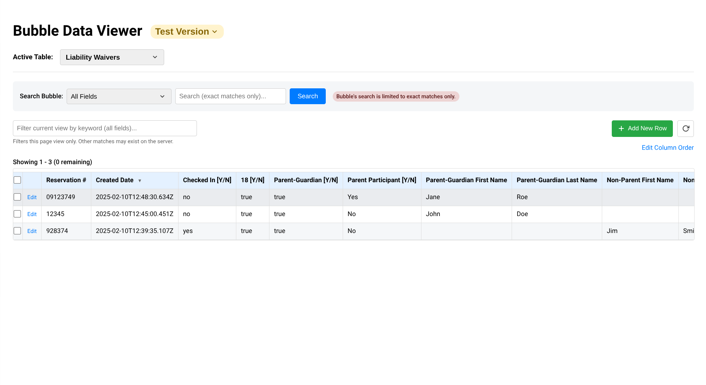
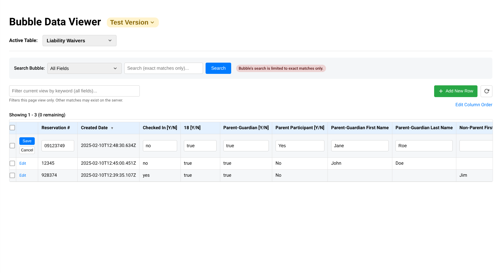
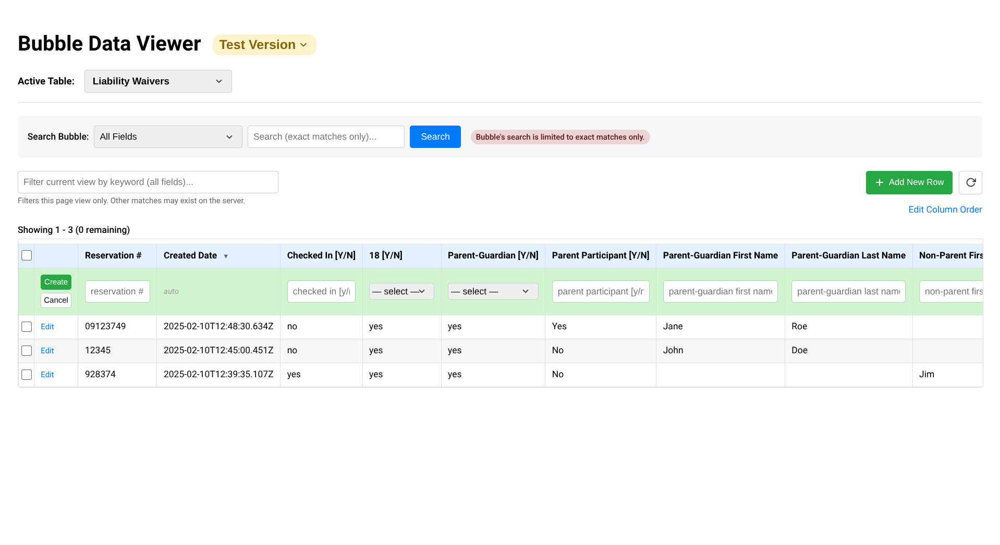
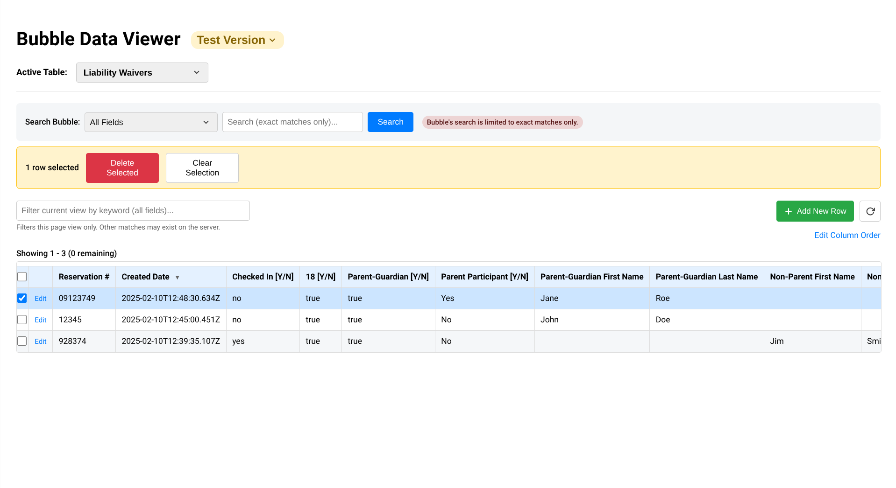
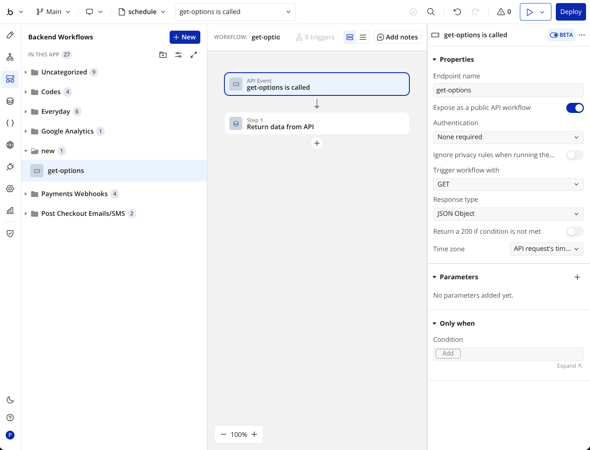
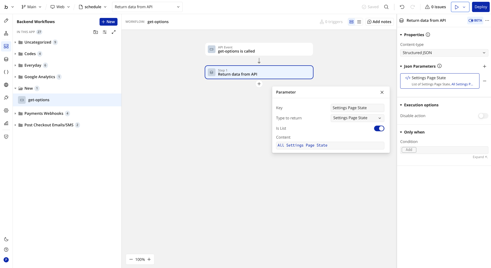

# Bubble App Data Manager
The default database admin UX in the bubble.io editor is terrible, and using Bubble to build admin pages with custom tables to manage your database is not much better. Bubble is not great at building tables for data, but this is easy to do well with code.

_This improved database manager is a single .html file that can be opened in any browser to manage your bubble database, just like you're using a webpage, with very little setup. This is all frontend code and does not require a python server or any setup beyond editing the [bubble_data_manager.html](bubble_data_manager.html) file to use your app URL and API key. That's it. There are some more advanced features that can be added with less than 20 minutes of setup._

## Features:
- Basic Setup and connect to your database in less than 5 minutes
- Uses at least 10x less RAM than a bubble editor window in your browser
- Automatically detects your app's data types and fields and data tables load with columns in the same order every time
- Columns can be reordered and their position can be saved permanently
- Responsive design with no horizontal scroll glitches or bugs
- Better UX for editing data than native bubble.
- Preserve's Bubble's type safety and option sets can easily be loaded
- And most importantly, you have all of this code, with no weird front-end limitations, so adding or making changes to this (with your favorite AI) is easier, faster, and more customizable than using bubble

Limitations:
- The search uses bubble's exact string match search which sucks, the keyword filter has better substring searching but only searches the current page view (100 rows). This could potentially be improved.
- Option sets must be manually imported (takes 5-10 minutes, step by step instructions are below). And new option sets need to be added manually. However, individual options update automatically once a set has been added, and everything works without importing option sets, but editing fields that use option sets requires typing out option names exactly correct (or else saving changes will fail with an error message).
- Table data changes need to be refreshed manually unless you want to add webhooks and a python server to this.

## Setup:

### Prerequites: 
- This script relies on API access to your app. 'Enable Data API' and the checkbox for each data type you want to access must be checked in your Bubble apps Settings>API>Public API endpoints.
- Each field you want to access must have privacy permissions enabled for 'Find this in searches' or it will not be included in the table. 'Modify this via API' must be selected for every field you want to be able to edit. 'Create this via API' and 'Delete this via API' must be checked to add or delete rows.

Note: This does not require exposing your Swagger file, and it is generally recommended to select 'Hide Swagger API' in bubble's API settings.

### Basic Setup:
_[setup in >5 mins]_
- Download or copy [bubble_data_manager.html](bubble_data_manager.html) and insert your DOMAIN_NAME and API_TOKEN (Bubble Settings>API>Admin API Tokens) in the configuration section:

~~~javascript
        // --- CONFIGURATION ---
        let VERSION = ''; // Default database to load: test = '/version-test' ; live = ''
        const DOMAIN_NAME = 'yourdomain.com';
        let API_BASE_URL = `https://${DOMAIN_NAME}${VERSION}/api/1.1/obj/`;
        const API_TOKEN = '<your_API_key>';
        const EXCLUDED_TYPES = []; // list any data types you want this script to always ignore entirely
~~~

- Open the bubble_data_manager.html in any browser, and it will automatically connect to your database using your bubble API token and load all data types and fields that have the prerequisite API access and privacy permissions. It will behave near exactly as if the page was part of your bubble app, but you will not need to login as your API authentication is hardcoded. DO NOT SHARE THIS FILE and be careful where you store it. Anyone with access to this file will have access to your database. 

Edit rows right in the table view:

Create rows from the table view:

Delete Rows:

### Optional Setup:
  
#### Reorder Columns:
_[setup in >10 mins]_
- You can click 'edit column order' to drag and drop columns, but the new column order will not be persistent unless new fields are created in your bubble database to store custom column order data:
  + Designate a bubble data type to store these settings in a permanent row (configure this data type as 'APP_SETTINGS_TYPE')
  + Create a text list field for APP_SETTINGS_TYPE for each data type that you want to save a custom order
  + The name of each of these fields must follow this format:
    - Begin each field name with 'column order ' (or change the FIELD_NAME_PREFIX to begin with a different prefix) followed by a space and the lowercase name of the data type (spaces included): 'FIELD_NAME_PREFIX data_type_name_lowercase'
        
Example Usage:
     
  - You want to generate tables for the 'Events' and 'Personal Records' data types.
  - You are storing sort order in the data type 'Special Data Constants' that has one row that is never deleted.
  - You created fields 'column order events' and 'column order personal records' in 'Special Data Constants'

The following configuration of the bubble_data_manager.html is all you need to save custom column ordering:
  ~~~js
        // Optional Configuration for storing persisent column order
        let originalHeadersRaw = [];
        const APP_SETTINGS_TYPE = 'specialdataconstants'; // name of data type that will store custom column data (lowercase, spaces removed)
        const FIELD_NAME_PREFIX = 'column order'; // arbitrary prefix all of the column sorting data field names in your database begin with
  ~~~

### Load Option Sets:
_[setup in >10 mins]_

Loading your app's option sets requires one extra step. While all of your app's option sets are public data that bubble does not allow you to hide, it is not available by API, and your browser will block this script from attempting to pull it from your app's URL...So you must create and maintain a backend workflow API endpoint for your option sets. Fortunately, that is very simple to do:
  + Create a public GET backend API workflow. No authentication is necessary because all of your option sets are always public. It must be named 'get-options':

  + Add each option set as a parameter. Set the key as the option set name, set 'is list', and set the content to all of that set's options:

Even with a large number of option sets, this does not take very long. 
That's it.
